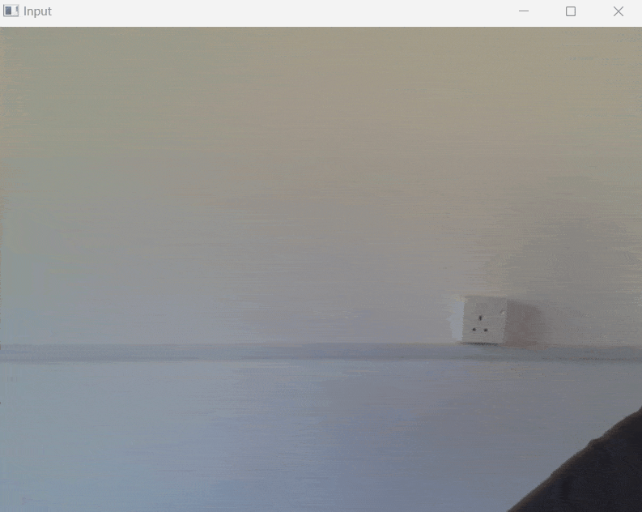

# Access Webcam with OpenCV and Python

# Introduction

Python provides various libraries for image and video processing. One of them is OpenCV. OpenCV is a vast library that helps in providing various functions for image and video operations.

With the help of OpenCV, we can capture a video from the camera. It lets you create a video capture object which is helpful to capture videos through webcam and then you may perform desired operations on that video.

## Installing Dependencies


- Installing Playsound

  ```
    pip install playsound
  ```


Note:- Turtle library is preinstalled with python programming language. Therefore, no need to install it separately.

## Demo



## Execution

- Running the program

  ```
    python run.py
  ```


Any Questions? | Conduct Me
---

* [Linkedin Profile](https://www.linkedin.com/in/gunarakulangunaretnam)
* [Facebook Profile](https://www.facebook.com/gunarakulan)
* [Twitter Profile](https://twitter.com/gunarakulang)
* [Instagram Profile](https://www.instagram.com/gunarakulan_gunaretnam/)
* [Youtube Channel](https://www.youtube.com/channel/UCMWkED5sabgVZSCKjZuRJXA/videos)  
